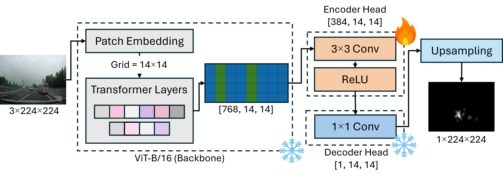
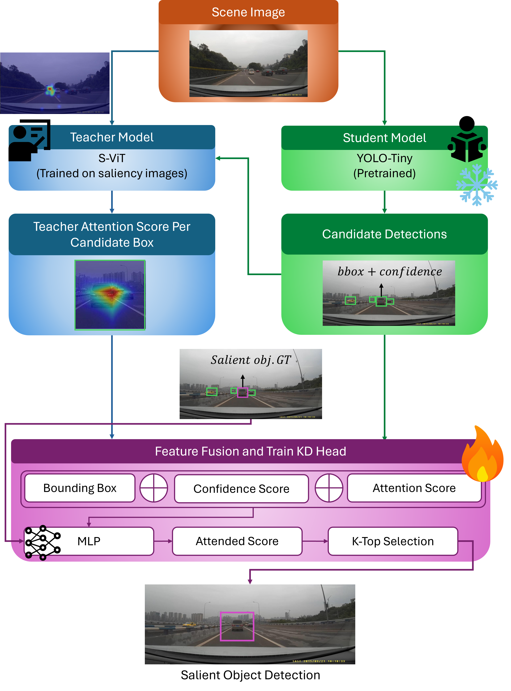

# SGKD

**Implementation of Saliency-guided knowledge distillation for driver-aware salient object detection**

  

## Abstract:
Salient object detection (SOD) isolates the most visually prominent and attention-grabbing parts of the driving scene by mimicking human visual attention to focus on important and most relevant objects for downstream perception and decision-making tasks. To inject driver attention into an object detection pipeline, we propose a saliency-guided knowledge distillation (SGKD) framework consisting of a teacher network trained to estimate driver saliency maps and a lightweight object detection model as the student. For each student-predicted bounding box, the teacher computes the attention energy inside the box and combines it with box-level features to form a compact vector, which is fed to a trainable rescoring head to predict whether the object is salient. We introduced the saliency vision Transformer (S-ViT) as a teacher network for saliency map estimation, while YOLO-Tiny is used as the student object detector. Experiments on the TrafficGaze dataset demonstrate the superior saliency prediction performance of S-ViT. Furthermore, results on TrafficGaze-SOD dataset show that SGKD significantly improves SOD accuracy, achieving an mAP\% of 67.90\%. With only 5.08M trainable parameters and 3.26 GFLOPs, the proposed SGKD framework is highly optimized for deployment on edge devices as a critical requirement for the demanding automotive sector.

## Saliency map generation of TrafficGaze
Please refer to `TrafficGazeSaliencyMapGen.py`. This code generates saliency images for all samples in the TrafficGaze dataset based on fixation points.

## TrafficGaze-based frame sampling and salient object annotation
Please refer to `ObjAnnotation.py`. This code first applies every 5-frame sampling, then applies YOLO11x to detect the three constraints and choose the attended objects. 

## S-ViT for salient map estimation
Please refer to `S_ViT.py`. This code implements the proposed Saliency ViT (S-ViT) on TrafficGaze dataset.

  

## MDSViTNet
Please refer to `MDSViTNet.py`. It implements MDSViTNet as a Vit-based model for saliency map estimation task.

## SGKD for salient object detection
Please refer to `KD_SOD.py`. This code implements the proposed SGKD on TrafficGaze-SOD dataset. First, it loads pretrained S-ViT teacher model which has been trained on salient maps. Then, Yolo-Tiny as the student model detects the objects in the scene. After that, the attention/energy is calculated by 

  

## Baseline salient object detection (with post-processing)
Please refer to `SalientObjBaseline.py`. This implements the Yolo-Tiny without KD method and uses a conventional computer vision method (spectral residual) as the bottom-up post-processing step for saliency region detection after object detection phase.# SGKD_COMPSAC2026
